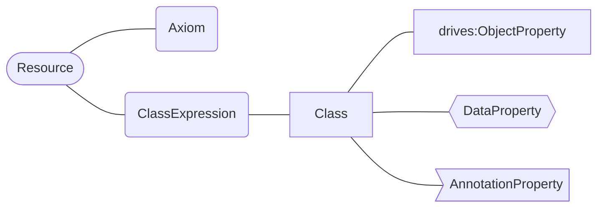
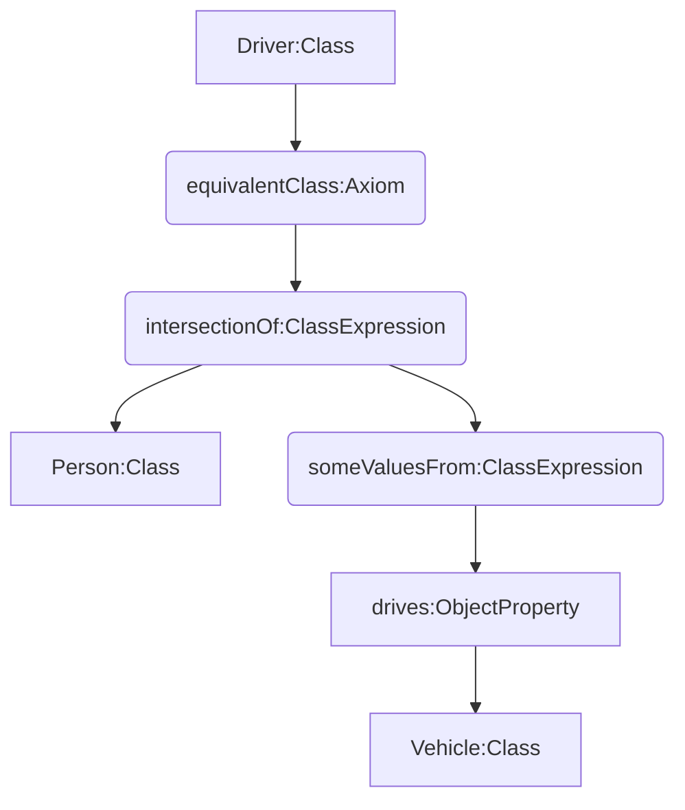
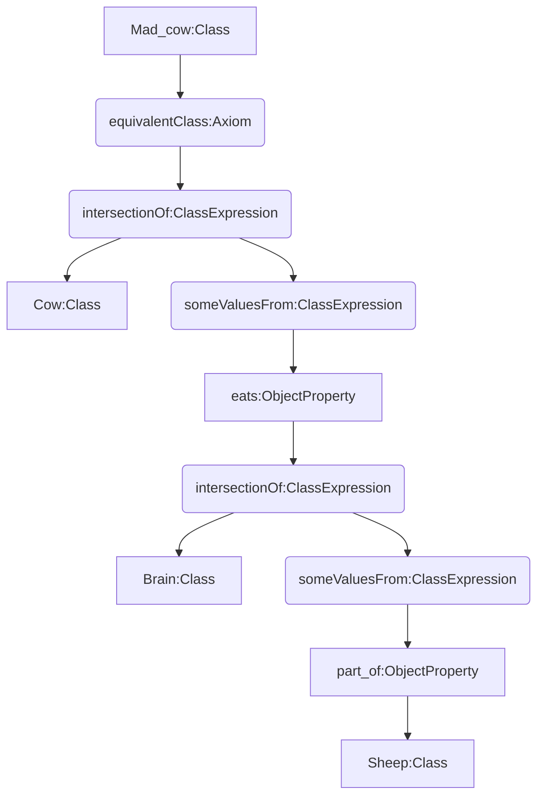
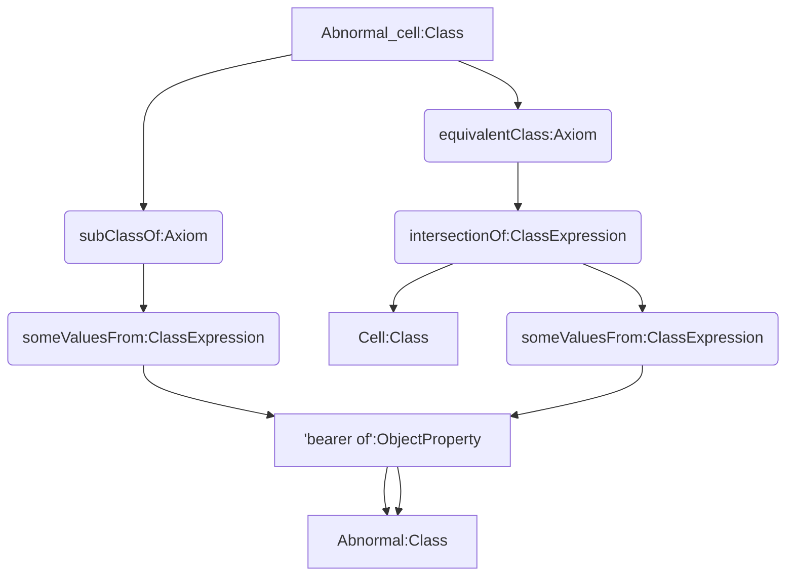
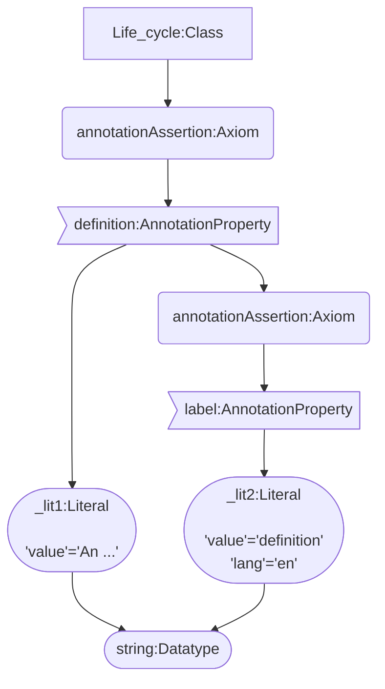
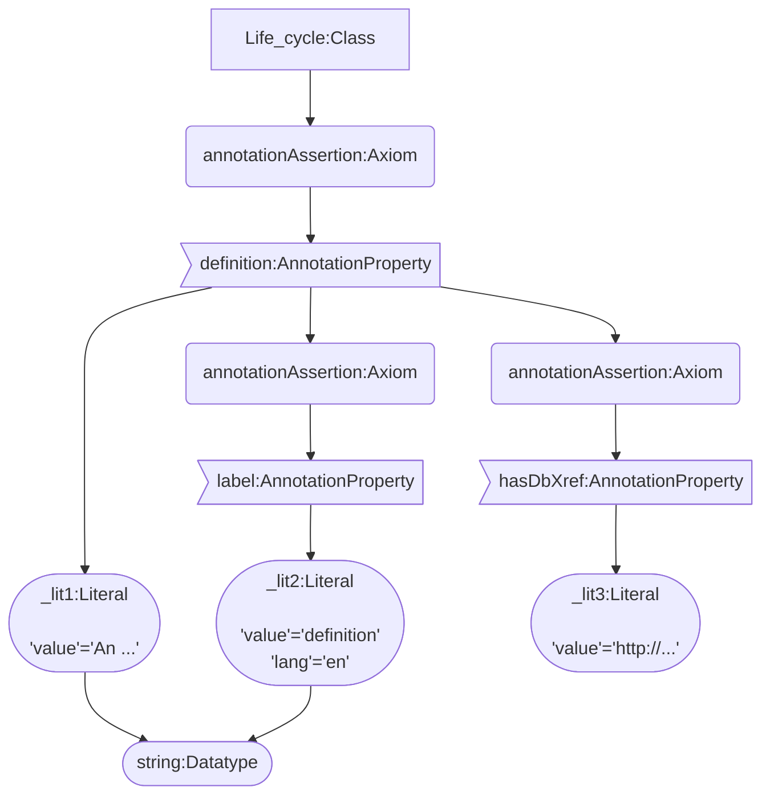

# Tranformation of OWL 2 EL ontologies to LPG graphs

---

# Introduction

This section applies the [draft model transformation][ref_draft_model] to translate OWL 2 EL axioms to a Labeled Property Graph (LPG) representation into specific use cases.
Our goal is to look for inconsistencies or missing information in the current OWL to LPG transformation

!> Take into account this is **work in progress**, no final decisions are considered here, there fore, the document is **subject to change** without notice.

# Complex OWL to LPG transformations

The validation of the OWL to LPG model (see [draft model][ref_draft_model]) is performed through several ontologies as use cases: [People Ontology][ref_people_ontology], [Cell Ontology][ref_cell_ontology]. Henceforth, the shape and color schema that is the following:




> We previously suppose that every node stores certain basic information as: `node-label` or `iri` properties.

## Use case: People Ontology

The [People Ontology][ref_people_ontology] is used in this section for validating and reproducing some axioms from the draft model.

?> **FYI**: The default namespace for the following use cases depends on the ontology use case. For succinctness, the namespace is shortened to `:`. For example `http://owl.man.ac.uk/2006/07/sssw/people#adult` becomes `:adult`.

### Driver class

In this example we apply the [Axiom 4](https://protege.stanford.edu/owl-to-lpg/#equivalent-intersection-axioms) to represent the class `:Driver`, which is a `:Person` that `:drives` any `:Vehicle`.

```Class expression
equivalent_to(person and (drives some vehicle))
```

|**Model** |
|-------------|
|**EquivalentClasses**( :Driver **ObjectIntersectionOf**(:Person **ObjectSomeValuesFrom**(:drives :Vehicle)))| 



### Mad cow class

The class `:Mad_cow` is denoted as equivalent class of the  following class expression:

```Class expression
equivalent_to(cow and (eats some (brain and (part_of some sheep))))
```
The previous expression can be transformed into an LPG model by using [Axiom 4](https://protege.stanford.edu/owl-to-lpg/#equivalent-intersection-axioms) and `ObjectIntersectionOf` class restrictions.

|**Model** |
|-------------|
|**EquivalentClasses**( :Mad_cow **ObjectIntersectionOf**(:Cow **ObjectSomeValuesFrom**(:eats **ObjectIntersectionOf**(:Brain **ObjectSomeValuesFrom**(:part_of :Sheep)))))| 



<!-- EquivalentClasses(<http://owl.man.ac.uk/2006/07/sssw/people#vegetarian> ObjectIntersectionOf(<http://owl.man.ac.uk/2006/07/sssw/people#animal> ObjectAllValuesFrom(<http://owl.man.ac.uk/2006/07/sssw/people#eats> ObjectComplementOf(<http://owl.man.ac.uk/2006/07/sssw/people#animal>)) ObjectAllValuesFrom(<http://owl.man.ac.uk/2006/07/sssw/people#eats> ObjectComplementOf(ObjectSomeValuesFrom(<http://owl.man.ac.uk/2006/07/sssw/people#part_of> <http://owl.man.ac.uk/2006/07/sssw/people#animal>)))) ) -->

## Use case: Cell Ontology

Here we provide examples of OWL to LPG using the [Cell Ontology][ref_cell_ontology] as use case.

###  SubclassOf Axiom with restrictions and EquivalentTo anonymous class 

A `:Abnormal_cell` (http://purl.obolibrary.org/obo/CL_0001061) is a subclass of the anonymous class `'bearer of' some abnormal`. Additionally, it is equivalent to two additional classes: `:Cell` (http://purl.obolibrary.org/obo/CL_0000000) and `'bearer of' some abnormal`. The class expression is the following:

```Class expression
subclass_of('bearer of' some abnormal)
equivalent_to(cell and ('bearer of' some abnormal))
```
This example states the [Axiom 3](https://protege.stanford.edu/owl-to-lpg/#subclassof-somevaluesfrom-axioms). Take into account that this axiom is also reproducible for its variations. For instance: using `AllValuesFrom` axiom restriction instead of a `SomeValuesFrom` axiom.

|**Model** |
|-------------|
|**SubClassOf**( :Cell **ObjectSomeValuesFrom**( :'bearer of' :cell ) )|
|**EquivalentClasses**(:Abnormal_cell **ObjectIntersectionOf** ( :Cell **ObjectSomeValuesFrom** (:'bearer of' :abnormal)))|




!> **Important**:  Double edged linkage between `bearer of:ObjectProperty` and `Abnormal:calss`.

### Annotation Axioms with Language-Tagged-Literal objects

In this example we apply the [Axiom 13](https://protege.stanford.edu/owl-to-lpg/#annotation-assertion-object-axioms), [Axiom 14](https://protege.stanford.edu/owl-to-lpg/#annotation-assertion-literal-axioms) and [Axiom 15](https://protege.stanford.edu/owl-to-lpg/#axiom-annotation-axioms) to represent that the class `:Life_cycle` (`iri: http://purl.obolibrary.org/obo/UBERON_0000104`) has a definition of type `xsd:string`.


|**Model** |
|-------------|
|**AnnotationAssertion**( :definition :Life_cycle "An entire span of an..."^^xsd:string )|
|**AnnotationAssertion**( :label :definition "definition"^^xsd:string@en )|



### Database cross references

In this case, we use the [previous Section](#annotation-axioms-with-language-tagged-literal-objects). However, this use case will address the problem of linking an `Annotation` to a http://www.geneontology.org/formats/oboInOwl#hasDbXref.

|**Model** |
|-------------|
|**AnnotationAssertion**( :definition :Life_cycle "An entire span of an..."^^xsd:string )|
|**AnnotationAssertion**( :label :definition "definition"^^xsd:string@en )|
|**AnnotationAssertion**( :hasDbXref :definition "https://...")|



<!-- Reusable references -->

[ref_draft_model]: https://protege.stanford.edu/owl-to-lpg/#transformation
[ref_people_ontology]: http://owl.man.ac.uk/2006/07/sssw/people.owl
[ref_cell_ontology]: https://bioportal.bioontology.org/ontologies/CL
